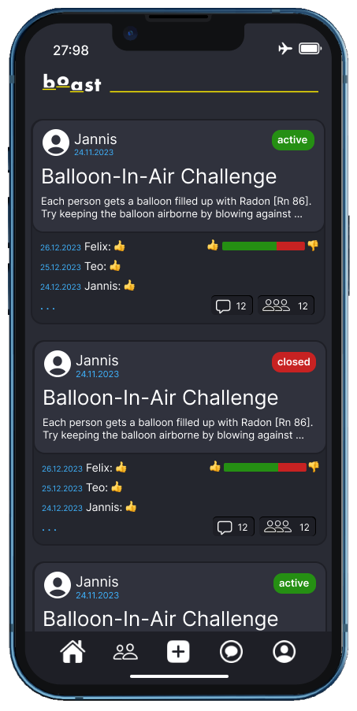

# Extended Color-Scheme
## Content
- [General](#general)
- [Elements](#elements)
  - [Post-Box](#post_box)

---

## General (+Preview)

 

- SF Symbols are used as navigation-bar icons and for post-boxes as well
- Fonts: Headlines [`Kelson`](https://www.myfonts.com/collections/kelson-font-armasen?) | Text [`Rleud`](https://www.myfonts.com/collections/rleud-font-stawix?)

   

#FFED00

Primary Color

   

#292B34

Background

   

#1E1F26

Navigation-Bar

   

#3FB4FF

Dates

   

#FFFFFF

Fonts

         

> Note - Fonts not used yet

---

## Elements

### Post-Box

#30323D

Upper Layer

   

#24262E

Lower Layer

   

1E1F26

Box-Border of both Layers

   

#258F13

#C72222

Status-box (active/closed) | Statistics

   

#1E1F26

#000000

Info-Box | Info-Box(Box-Shadow)

 

 

---

